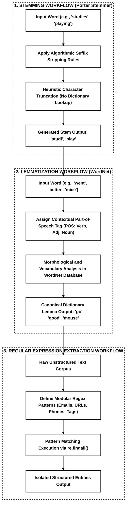

# Experiment 3: Stemming, Lemmatization and Regular Expressions

**Name:** Rudransh Sogani  
**SAP ID:** 500120440  

## Objective
To implement and analyze core text normalization techniques (Stemming and Lemmatization) using the NLTK library, and to perform pattern-based information extraction from unstructured text using Regular Expressions (Regex).

## Workflow and Architecture

## Procedure & Implementation
The experiment is structured into three dedicated sections:

1. **Stemming (`Experiment 3.1`):**
   * Initializing `nltk.stem.PorterStemmer` (`PorterStemmer()`).
   * Passing the target word corpus: `playing`, `played`, `plays`, `studies`, `studying`, `connected`, `connection`, `computers`.
   * Applying rule-based suffix stripping to extract the morphological root (stem) (`stemmer.stem(word)`).
   * Displaying the original words mapped against their corresponding stems.

2. **Lemmatization (`Experiment 3.2`):**
   * Initializing `nltk.stem.WordNetLemmatizer` with WordNet corpus support (`WordNetLemmatizer()`).
   * Processing input words: `cats`, `dogs`, `running`, `runs`, `ran`, `studies`, `studying`, `better`, `children`, `mice`, `went`, `ate`, `leaves`, `caring`.
   * Incorporating Part-of-Speech (POS) tags to guide morphological resolution for nouns, verbs, and adjectives (`lemmatizer.lemmatize(word, pos)`).
   * Producing canonical dictionary base forms (lemmas) for irregular inflections and plurals.

3. **Information Extraction with Regular Expressions (`Experiment 3.3`):**
   * Defining modular regex patterns for distinct entity classes (`import re`):
     * **Email addresses:** `\b[A-Za-z0-9._%+-]+@[A-Za-z0-9.-]+\.[A-Za-z]{2,}\b`
     * **URLs:** `https?://[^\s]+|\bwww\.[^\s]+\b`
     * **Mobile numbers:** `(?:\+91[-\s]?)?[6-9]\d{9}`
     * **Hashtags:** `#[A-Za-z0-9_]+`
     * **Mentions:** `(?<!\S)@[A-Za-z0-9_]+`
   * Executing extraction across unstructured workshop text using `re.findall()` (`re.findall(pattern, text)`).
   * Isolating and formatting extracted entities.

## Observations

| Experiment Stage | Technique / Module | Target Input | Result / Transformed Output |
| :--- | :--- | :--- | :--- |
| **Stemming** | `nltk.stem.PorterStemmer` | Inflected and affixed words (`studies`, `computers`) | Truncated base forms (`studi`, `comput`) |
| **Lemmatization (Noun)** | `WordNetLemmatizer` (POS: `n`) | Plural and irregular nouns (`children`, `mice`, `leaves`) | Canonical singular forms (`child`, `mouse`, `leaf`) |
| **Lemmatization (Verb)** | `WordNetLemmatizer` (POS: `v`) | Irregular past/continuous verbs (`went`, `ran`, `ate`) | Root infinitive verbs (`go`, `run`, `eat`) |
| **Lemmatization (Adj)** | `WordNetLemmatizer` (POS: `a`) | Comparative adjective (`better`) | Base positive adjective (`good`) |
| **Regex: Emails** | `re` pattern matching | Unstructured text | `nlpworkshop@gmail.com`, `support@python.org` |
| **Regex: URLs** | `re` pattern matching | Unstructured text | `https://www.nlpworkshop.com`, `www.python.org`, `https://github.com/NLPWorkshop` |
| **Regex: Mobile Numbers**| `re` pattern matching | Unstructured text | `+91-9876543210`, `9123456789` |
| **Regex: Social Tags** | `re` pattern matching | Unstructured text | `#NLP`, `#Python`, `#MachineLearning`, `@NLPWorkshop`, `@PythonLearner` |

## Result Interpretation & Learnings
* **Heuristic vs. Morphological Normalization:** Stemming operates on algorithmic suffix stripping without vocabulary verification, often yielding non-dictionary tokens (such as `studi`). In contrast, Lemmatization leverages morphological vocabularies to guarantee valid lexical headwords.
* **Contextual POS Significance:** Lemmatization requires explicit or inferred Part-of-Speech context to accurately resolve irregular verb conjugations (such as `went` to `go`) and comparative adjectives (such as `better` to `good`).
* **Entity Extraction Precision:** Regular expressions provide a deterministic and robust approach for parsing unstructured text to isolate structured contact details, web links, and social metadata.
